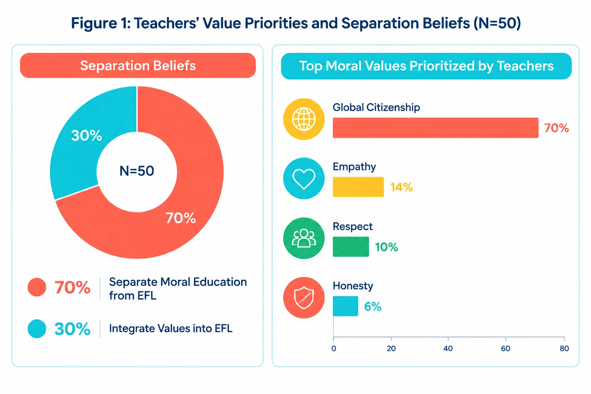
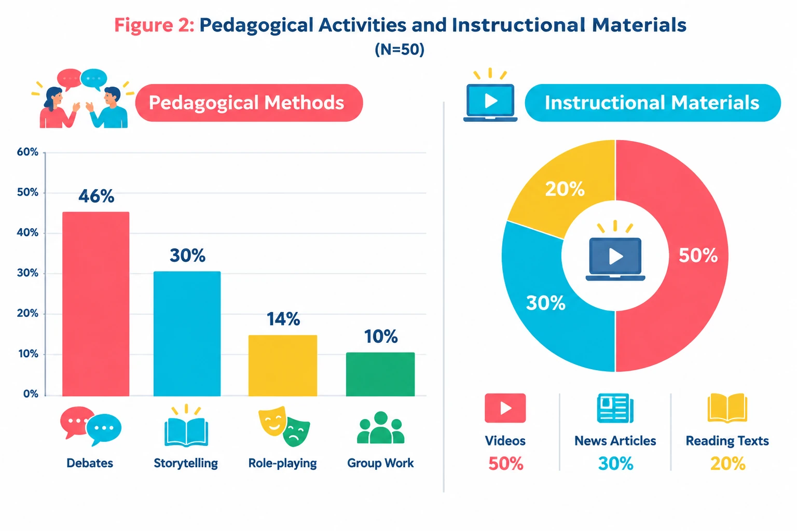
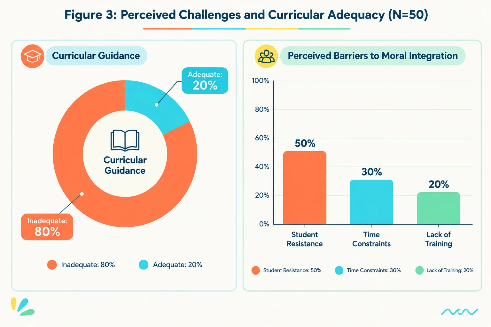
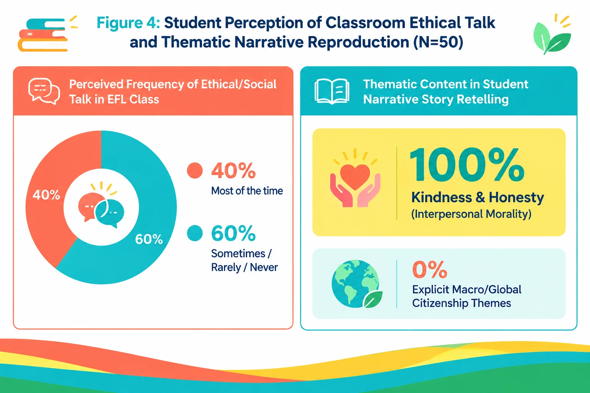

readme_content = r'''# Integrating Moral Values in Turkish EFL Classrooms: Teachers’ Beliefs, Pedagogical Practices, and Students’ Narrative Responses

[](https://creativecommons.org/licenses/by/4.0/)
[](https://opensource.org/licenses/MIT)
[](https://www.python.org/downloads/)
[](https://doi.org/10.5281/zenodo.22953550)
[-brightgreen.svg)](doc/REPRODUCIBILITY_GUIDE.md)

---

## 📌 Graphical Abstract

<p align="center">
  
</p>

*Figure: Graphical overview of the mixed-methods empirical design and the three core cross-cohort tensions (Belief–Practice, Aspiration–Material, and Pedagogy–Reception).*

---

## 📊 Visual Results & Figure Gallery

### Figure 1: Teachers’ Value Priorities & Separation Beliefs ($N=50$)
<p align="center">
  
</p>

### Figure 2: Pedagogical Activities & Instructional Materials ($N=50$)
<p align="center">
  
</p>

### Figure 3: Curricular Guidance & Perceived Barriers ($N=50$)
<p align="center">
  
</p>

### Figure 4: Student Ethical Talk Frequency & Thematic Reproduction ($N=50$)
<p align="center">
  
</p>

---

## 🔬 Research Overview & Sample Independence

This open-science research repository contains the empirical datasets, statistical verification pipelines, reproducible analysis notebooks, and documentation for the study examining the intersection of moral values, teacher beliefs, pedagogical enactment, and learner reception in Turkish EFL contexts.

> **Methodological Note on Sample Structure:**  
> The study analyzes **two independent, unlinked cohorts**:
> - **Cohort 1:** 50 Turkish EFL Teachers ($N=50$)
> - **Cohort 2:** 50 Turkish EFL Secondary/Tertiary Students ($N=50$)
>
> ⚠️ **Important:** Teacher and student datasets are **not dyadic or paired** (i.e., students are not nested within the participating teachers' specific classrooms). All analyses and reported intervals are **strictly descriptive and cross-cohort**. Findings represent comparative aggregate distributions and must not be interpreted as causal relationships or direct student-teacher correlations.

---

## 📈 Summary of Empirical Results

All confidence intervals are calculated using the **Wilson Score 95% Confidence Interval** method, which provides robust coverage near boundary proportions ($p=1.00$). Standard Errors ($SE$) are computed as $\sqrt{\frac{p(1-p)}{N}}$.

### Table 1: Teachers' Core Value Priorities and Separation Beliefs ($N=50$)

| Dimension / Survey Item | Category / Response | $n$ | Proportion ($p$) | Standard Error ($SE$) | Wilson 95% CI |
|---|---|---|---|---|---|
| **Belief on Separation** | Moral education should be separate from EFL | 35 | 70.0% | 0.0648 | [56.25%, 80.90%] |
| | Moral education should be integrated with EFL | 15 | 30.0% | 0.0648 | [19.10%, 43.75%] |
| **Prioritized Value** | Global Citizenship | 35 | 70.0% | 0.0648 | [56.25%, 80.90%] |
| | Empathy | 7 | 14.0% | 0.0491 | [6.99%, 25.78%] |
| | Respect | 5 | 10.0% | 0.0424 | [4.35%, 21.36%] |
| | Honesty | 3 | 6.0% | 0.0336 | [2.06%, 16.22%] |

---

### Table 2: Teachers' Pedagogical Activities and Instructional Materials ($N=50$)

| Dimension | Category / Method | $n$ | Proportion ($p$) | Standard Error ($SE$) | Wilson 95% CI |
|---|---|---|---|---|---|
| **Pedagogical Technique** | Debates | 23 | 46.0% | 0.0705 | [32.95%, 59.67%] |
| | Storytelling | 15 | 30.0% | 0.0648 | [19.10%, 43.75%] |
| | Role-playing | 7 | 14.0% | 0.0491 | [6.99%, 25.78%] |
| | Group work | 5 | 10.0% | 0.0424 | [4.35%, 21.36%] |
| **Instructional Materials**| Digital Videos | 25 | 50.0% | 0.0707 | [36.64%, 63.36%] |
| | News Stories / Articles | 15 | 30.0% | 0.0648 | [19.10%, 43.75%] |
| | Academic / Reading Articles | 10 | 20.0% | 0.0566 | [11.24%, 33.04%] |

---

### Table 3: Official Curricular Guidance and Perceived Implementation Obstacles ($N=50$)

| Dimension | Category / Barrier | $n$ | Proportion ($p$) | Standard Error ($SE$) | Wilson 95% CI |
|---|---|---|---|---|---|
| **Curricular Guidance** | Inadequate / Insufficient | 40 | 80.0% | 0.0566 | [66.96%, 88.76%] |
| | Adequate / Sufficient | 10 | 20.0% | 0.0566 | [11.24%, 33.04%] |
| **Reported Barriers** | Perceived Student Resistance | 25 | 50.0% | 0.0707 | [36.64%, 63.36%] |
| | Instructional Time Constraints | 15 | 30.0% | 0.0648 | [19.10%, 43.75%] |
| | Lack of Teacher Training & Guidance | 10 | 20.0% | 0.0566 | [11.24%, 33.04%] |

---

### Table 4: Student-Reported Classroom Ethical Talk Frequency and Narrative Reproduction Themes ($N=50$)

| Dimension | Level / Category | $n$ | Proportion ($p$) | Standard Error ($SE$) | Wilson 95% CI |
|---|---|---|---|---|---|
| **Ethical Talk Frequency** | Most of the time | 20 | 40.0% | 0.0693 | [27.61%, 53.82%] |
| | Sometimes | 15 | 30.0% | 0.0648 | [19.10%, 43.75%] |
| | Rarely | 10 | 20.0% | 0.0566 | [11.24%, 33.04%] |
| | Never | 5 | 10.0% | 0.0424 | [4.35%, 21.36%] |
| **Oral Narrative Themes** | Kindness and/or Honesty Presence | 50 | 100.0% | 0.0000 | [92.86%, 100.00%] |

*Qualitative Narrative Note:* The 100% presence of interpersonal moral themes reflects salient narrative recall and cognitive framing within the classroom storytelling task, rather than direct behavioral modification or longitudinal moral internalization.

---

## 🔍 Key Findings & The Three Empirical Tensions

1. **Belief–Practice Tension:**  
   While **70% of teachers** formally advocate separating moral instruction from language mechanics, **40% of students** report that ethical discussions take place "most of the time", demonstrating that values permeate communicative language teaching through hidden and incidental curricula.

2. **Aspiration–Material Tension:**  
   Teachers overwhelmingly aspire to promote **Global Citizenship (70%)**, yet pedagogical practices rely predominantly on video materials (50%) and interpersonal narratives of **Kindness and Honesty (100% student thematic recall)**, revealing a pedagogical gap between abstract cosmopolitan aspirations and local narrative materials.

3. **Pedagogy–Reception Tension:**  
   Teachers prefer dialogic and debate-oriented activities (46%) but simultaneously report **student resistance (50%)** and **time constraints (30%)** as primary obstacles, pointing to the structural need for formal training in managing morally sensitive communicative tasks.

---

## 📁 Repository Directory Structure

```text
Turkish-efl-moral-values-study/
│
├── .github/
│   └── workflows/
│       └── reproducibility.yml      # CI/CD automated reproduction test pipeline
│
├── Figures/                          # High-resolution figures and graphical abstracts
│   ├── 1.webp                       # Figure 1: Value Priorities & Separation Beliefs
│   ├── 2.webp                       # Figure 2: Pedagogical Activities & Materials
│   ├── 3.webp                       # Figure 3: Curricular Guidance & Barriers
│   ├── 4.webp                       # Figure 4: Student Ethical Talk & Narrative Themes
│   ├── graphical abstarct.webp      # Visual Graphical Abstract
│   ├── figure_teacher_summary.png   # Full Teacher Appendix Dashboard
│   └── figure_student_summary.png   # Full Student Appendix Dashboard
│
├── doc/                              # Comprehensive research and methodology documents
│   ├── CODEBOOK_AND_INSTRUMENTS.md  # Detailed item codebook & qualitative rubrics
│   ├── DATA_DICTIONARY.md           # CSV column schema and enumerated types
│   ├── REPRODUCIBILITY_GUIDE.md     # Step-by-step reproduction instructions
│   ├── RESEARCH_OVERVIEW.md         # Full theoretical framework and RQ definitions
│   └── STATISTICAL_METHODS.md       # Exact Wilson Score CI and SE mathematical formulations
│
├── data/                             # Raw and processed research datasets
│   ├── Teachers_Data.csv            # Raw survey responses (N=50 Teachers)
│   ├── Students_Data.csv            # Raw survey & narrative coding (N=50 Students)
│   ├── Teacher_Stats.csv            # Computed summary statistics for teachers
│   ├── Student_Stats.csv            # Computed summary statistics for students
│   └── Processed_Data_English.xlsx  # Master formatted spreadsheet
│
├── notebooks/                        # Jupyter Notebooks for analysis and auditing
│   ├── 01_Data_Generation_and_Cleaning.ipynb
│   ├── 02_Wilson_Confidence_Intervals_and_SE.ipynb
│   ├── 03_Publication_Figures_Generation.ipynb
│   ├── 04_Qualitative_Thematic_Coding_and_Audit.ipynb
│   └── 05_Comprehensive_Reproducibility_and_Verification.ipynb
│
├── citation.cff                      # Academic Citation Metadata (APA / BibTeX)
├── environment.yml                   # Conda environment specification
├── meta.yml                          # Comprehensive project metadata
└── README.md                         # Project landing documentation (this file)
```

---

## ⚙️ How to Reproduce

### 1. Clone the repository
```bash
git clone https://github.com/Pegi1727/Turkish-efl-moral-values-study.git
cd Turkish-efl-moral-values-study
```

### 2. Set up the Conda environment
```bash
conda env create -f environment.yml
conda activate efl-moral-values
```

### 3. Run the complete reproduction pipeline
```bash
jupyter nbconvert --to notebook --execute notebooks/05_Comprehensive_Reproducibility_and_Verification.ipynb
```

---

## 📝 Citation

If you utilize the datasets, analysis pipelines, or findings in your research, please cite:

```bibtex
@article{merrikhi2026integrating,
  title={Integrating Moral Values in Turkish EFL Classrooms: Teachers’ Beliefs, Pedagogical Practices, and Students’ Narrative Responses},
  author={Merrikhi, Pegah},
  journal={Applied Linguistics & Language Education},
  year={2026},
  doi={10.5281/zenodo.XXXXXXX},
  url={https://github.com/Pegi1727/Turkish-efl-moral-values-study}
}
```

```text
Merrikhi, P. (2026). Integrating Moral Values in Turkish EFL Classrooms: Teachers’ Beliefs, Pedagogical Practices, and Students’ Narrative Responses. https://doi.org/10.5281/zenodo.XXXXXXX
```

---

## 📄 License
- **Data & Documentation:** Distributed under the [Creative Commons Attribution 4.0 International License (CC BY 4.0)](https://creativecommons.org/licenses/by/4.0/).
- **Code & Scripts:** Distributed under the [MIT License](https://opensource.org/licenses/MIT).
'''
from pathlib import Path
p = Path('/mnt/data/README.md')
p.write_text(readme_content, encoding='utf-8')
check = p.read_text(encoding='utf-8')
print(f'Wrote and verified: {p}')
print(f'Characters: {len(check)} | UTF-8 bytes: {p.stat().st_size} | Lines: {len(check.splitlines())}')
print('Checks:', {'starts_with_title': check.startswith('# Integrating Moral Values'), 'has_four_tables': all(f'### Table {i}:' in check for i in range(1,5)), 'has_directory_tree': 'Turkish-efl-moral-values-study/' in check, 'ends_with_license': check.rstrip().endswith('https://opensource.org/licenses/MIT).')})
